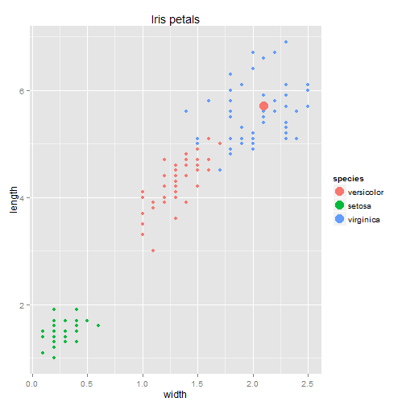

## The iris petal length predictor

1. Unique web application
2. Objective: Estimate the petal length of an iris from its species and its petal width
3. Highly interactive
4. Powerful explanatory graphics
5. Public and free !


https://patrocle-troy.shinyapps.io/project/

--- .class #id 

## The methodology

1. R programming language
2. Data set: Edgar Anderson's Iris Data (R-base dataset)
3. Prediction algorithm: linear regression 
  1. Length against width
  2. One regression per species

---

## The code
* Function: `predictLength` = linear regression for each species
* Input: `inSpecies` = species (as an integer), `inWidth` = petal width (in cm)
* Output: `dpredict` = iris dataframe with the estimated petal length

```r
predictLength<-function(inSpecies,inWidth)
{ inSpecFact<-switch(inSpecies,'1'='setosa','2'='versicolor','3'='virginica');
  df = iris[,c('Petal.Length','Petal.Width','Species')]; colnames(df)<-c('length','width','species');
  lmselect<-lm(length~width,data=df[df$species==inSpecFact,]); 
  outLength<-predict(lmselect,data.frame(width=inWidth));
  dpredict<-data.frame(width=inWidth,length=outLength,species=inSpecFact); }
```
Example: `inSpecies=2` (versicolor); `inWidth=2.1`; output = length 

```r
print(predictLength(2,2.1)$length)
```

```
## [1] 5.706857
```

--- 
## The plot

 


